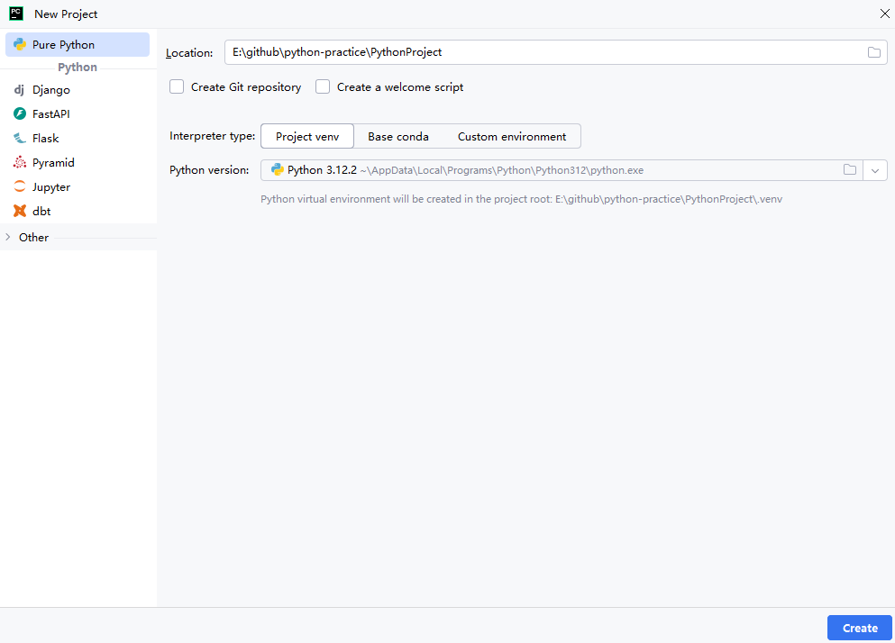
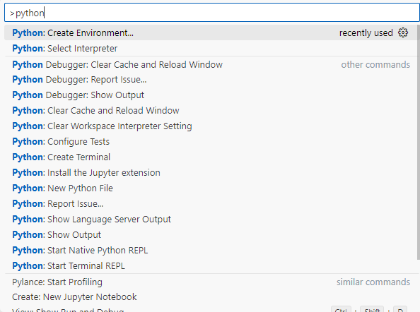
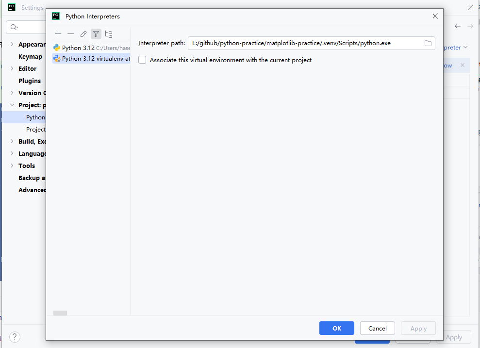
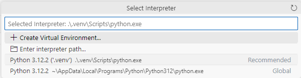
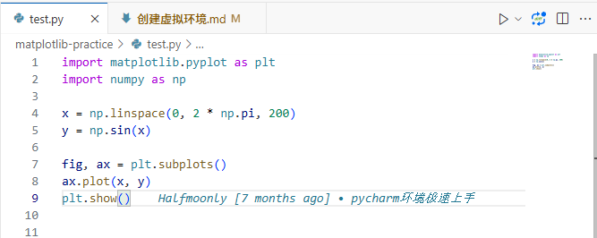

## 创建虚拟环境



或者VSCode打开ctrl shift p，创建干净的虚拟环境



## 激活虚拟环境

进入当前项目的虚拟空间venv

```shell
cd E:\github\python-practice\matplotlib-practice\.venv\Scripts
#or 根据你实际项目中的.venv而定
cd E:\github\python-practice\.venv\Scripts
```

激活虚拟环境

```shell

E:\github\python-practice\matplotlib-practice\.venv\Scripts>activate.bat

```

使用虚拟环境下的pip，pip升级

```shell

(.venv) E:\github\python-practice\matplotlib-practice\.venv\Scripts>pip list
Fatal error in launcher: Unable to create process using '"E:\github\python-practice\matplotlib\.venv\Scripts\python.exe"  "E:\github\python-practice\matplotlib\.venv\Scripts\pip.exe" list': ???????????

(.venv) E:\github\python-practice\matplotlib-practice\.venv\Scripts>python -m pip install -U pip
Looking in indexes: https://pypi.mirrors.ustc.edu.cn/simple
Requirement already satisfied: pip in e:\github\python-practice\matplotlib-practice\.venv\lib\site-packages (23.2.1)
Collecting pip
  Downloading https://mirrors.ustc.edu.cn/pypi/packages/c9/bc/b7db44f5f39f9d0494071bddae6880eb645970366d0a200022a1a93d57f5/pip-25.0.1-py3-none-any.whl (1.8 MB)
     ━━━━━━━━━━━━━━━━━━━━━━━━━━━━━━━━━━━━━━━━ 1.8/1.8 MB 2.9 MB/s eta 0:00:00
Installing collected packages: pip
  Attempting uninstall: pip
    Found existing installation: pip 23.2.1
    Uninstalling pip-23.2.1:
      Successfully uninstalled pip-23.2.1
Successfully installed pip-25.0.1

(.venv) E:\github\python-practice\matplotlib-practice\.venv\Scripts>pip list               
Package Version
------- -------
pip     25.0.1
```

## 安装项目依赖

安装pip依赖至当前的虚拟局部环境

```shell
(.venv) E:\github\python-practice\matplotlib-practice\.venv\Scripts>pip install matplotlib

(.venv) E:\github\python-practice\matplotlib-practice\.venv\Scripts>pip install numpy pandas scipy

(.venv) E:\github\python-practice\matplotlib-practice\.venv\Scripts>pip list         
Package         Version
--------------- -----------
contourpy       1.3.1
cycler          0.12.1
fonttools       4.56.0
kiwisolver      1.4.8
matplotlib      3.10.1
numpy           2.2.3
packaging       24.2
pandas          2.2.3
pillow          11.1.0
pip             25.0.1
pyparsing       3.2.1
python-dateutil 2.9.0.post0
pytz            2025.1
scipy           1.15.2
six             1.17.0
tzdata          2025.1


```

## 确认虚拟环境

最后记得确定你当前的python环境为虚拟环境，而不是全局环境



VSCode 打开ctrl shift p，选择解释器，查看或切换当前虚拟环境为.venv



VSCode可以在右下角直接看到当前的虚拟环境比如3.12.2(.venv)


## 自动激活虚拟环境(推荐)
使用VScode安装了必要python插件之后, py文件右上角会提供可视化运行按钮
- Python
- Pylance
- Python Debugger
- Python Environments



该可视化运行按钮支持在terminal中自动激活虚拟环境, 以下激活脚本是插件预执行的
```shell
PS E:\github\python-practice> & E:/github/python-practice/.venv/Scripts/Activate.ps1
```
每次运行代码, 后台完整脚本如下, 无需人工操作, 省心省力
```shell
PS E:\github\python-practice> & E:/github/python-practice/.venv/Scripts/Activate.ps1
(.venv) PS E:\github\python-practice> & E:/github/python-practice/.venv/Scripts/python.exe e:/github/python-practice/matplotlib-practice/test.py
(.venv) PS E:\github\python-practice> & E:/github/python-practice/.venv/Scripts/python.exe e:/github/python-practice/matplotlib-practice/test.py
(.venv) PS E:\github\python-practice> & E:/github/python-practice/.venv/Scripts/python.exe e:/github/python-practice/matplotlib-practice/test.py
(.venv) PS E:\github\python-practice> & E:/github/python-practice/.venv/Scripts/python.exe e:/github/python-practice/matplotlib-practice/test.py
```